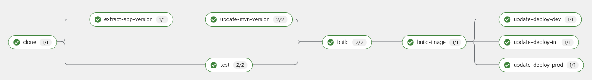

Tekton is a Cloud Native solution to build Continous Integration pipelines. 

The power of Tekton can be combined with ArgoCD as a Continous Deployment tool, getting a CI/CD complete cycle. 

# Tools
* OpenShift Pipelines 1.9 (Tekton Pipelines: v0.41.1)
* OpenShift GitOps 

# Installation

## ArgoCD 

Operator installation:

```bash
oc apply -f operator/openshift-gitops.yaml
```

Retrieve ArgoCD route: 

```bash
oc get route -A | grep openshift-gitops-server | awk '{print $3}'
```

Get the ArgoCD admin password: 

```bash
oc -n openshift-gitops get secret openshift-gitops-cluster -o json | jq -r '.data["admin.password"]' | base64 -d
```

ArgoCD needs some privileges to create specific resources. In this demo, we'll apply cluster-role to ArgoCD to avoid the fine-grain RBAC.

```bash
oc apply -f gitops/cluster-role.yaml
```

Now, we apply the bootstrap application:

```bash
oc apply -f gitops/argocd-app-bootstrap.yaml
```

The bootstrap application initializes the cluster with the necessary dependencies and configuration. This repository is structure functionally:

* **apps**: this folder contains the configuration of the applications that are running on the cluster.
* **dependencies**: our system needs some dependencies which are installed by ArgoCD.
* **gitops**: contains all the ArgoCD objects and cluster configuration as security role bindings.
* **operator**: operators definitions
* **pipelines**: pipelines definitions which are managed by ArgoCD too.
* **tasks**: our own tasks definitions.
* **triggers**: triggers to configure and deploy automatically the pipelines.
* **workspaces**: pvc creation. You also can use a PVC template. 

## Tekton

As we're using ArgoCD, we only have to apply the ArgoCD bootstrap application and it's going to install the Tekton Operator. This operation was done in the previous step. 

# Cloud Native Lifecycle

## Continous Integration with Tekton (CI)

### Tasks

A task is a series of ```steps``` that make one or some actions like clone, build, test or something necessary. A task receives input parameters and produces outputs that can be used by others tasks.

By default, Tekton provides a series of tasks for common operations but we can build new tasks. In addition, a task is deployed in OpenShift as a Cloud Native object that can be reused. 

A task can be launched with specific parameters, this instance is called ```TaskRun```. In our case, we only are going to launch its with Pipelines.

For this example, we're going to use these tasks:

* **git-clone:** to clone the repository
* **maven:** to test and build the artifact
* **buildah:** to build the image

### Pipelines

Define a series of ```tasks``` to build a specific application or functional unit. A pipeline can be launched manually using ```PipelineRun``` or using an event.

In our case, we're using the previous task definitions to define the following steps in our pipeline:



### Triggers

Using triggers, we can manage easily the pipeline execution automatically. For example, in this workshop we configure a webhook in our git repository that initialize the pipeline, to do that, we use the following objects:

* **Route**: the route defines the endpoint where the webhook has to call. 
* **EventListener**: this object defines how it must actuate when a webhook is received. It's essential to complete ```bindings``` and ```template```sections. 
* **TriggerBinding**: indicate the values that substitute the different pipeline variables, for example, you can use values received in the webhook.
* **TriggerTemplate**: the definition of the ```PipilineRun``` which is the object that represents a pipeline execution.

## Continous Deployment with ArgoCD (CD)

Once, our application image is in the containers' registry, we can deploy it. 

ArgoCD ensures that the definition of our deployment is exactly what we have in a Git repository. 

In this example, our pipeline finishes changing the image version in a git repository that ArgoCD is watching. When ArgoCD detects the change, it updates the OpenShift deployment. 

# Run the demo

If you've completed the installation section, you can start this step. 

At this moment, we've deployed all our dependencies, security and ArgoCD applications but we need our code. I've implemented two repositories, one for a Quarkus application and another with a Helm chart that contains the deployment definition. 

* [Quarkus application](https://github.com/dbgjerez/workshop-tekton-argocd-app-quarkus)
* [Helm chart](https://github.com/dbgjerez/workshop-tekton-argocd-app-quarkus-config)

Now, it's the moment to play with them.

## Gogs

Although our repositories are in GitHub we fork them in an internal Git server to avoid a lot of unnecessary commits. 

This internal server is Gogs. You can enter in ArgoCD and visualize the state of Gogs, if it is correctly synchronized we can enter with user and password ```gogs```.

```bash
oc get route -n gogs gogs -o template --template='{{"http://"}}{{.spec.host}}'
```

We can see that we don't have repositories, so we'll initialize it with a specific pipeline. To run it: 

```bash
oc apply -f gitops/init-pipeline-run.yaml
```

